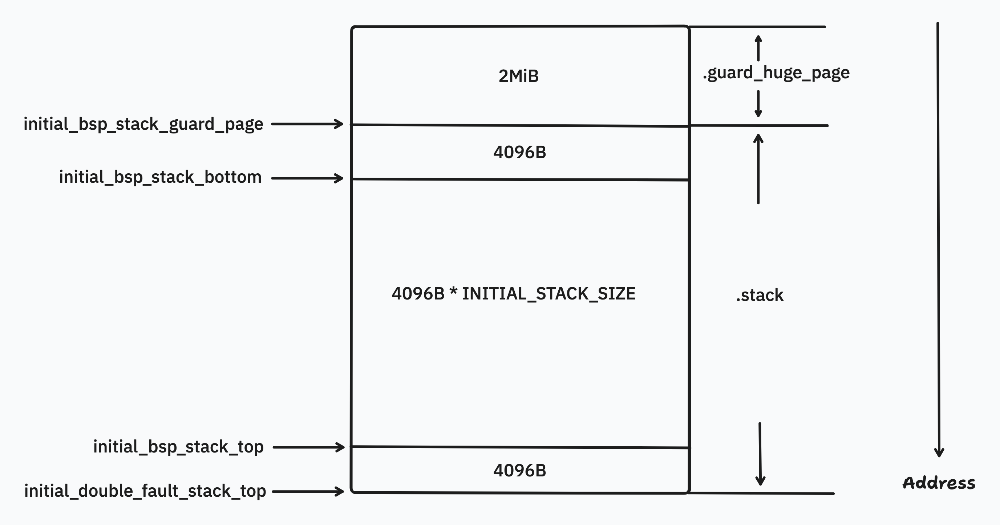

# Initial Assembly Code

Theseus starts from the `_start` function in `kernel/nano_core/src/asm/bios/boot.asm`, which is an assembly file. Next, we will progressively dissect the contents of this file.

```asm
%include "defines.asm"

global _start

; Section must have the permissions of .text
section .init.text32 progbits alloc exec nowrite
bits 32 ;We are still in protected mode

extern set_up_SSE

%ifdef ENABLE_AVX
extern set_up_AVX
%endif ; ENABLE_AVX
```

`boot.asm` starts by including necessary header files, which typically contain global definitions such as constants and macro definitions used across multiple files. Then, it defines a section named `.init.text32` designed for initialization under 32-bit protected mode, preparing the operating system for transitioning to a higher functionality state.

```asm
_start:
	; The bootloader has loaded us into 32-bit protected mode. 
	; Interrupts are disabled. Paging is disabled.

	; To set up a stack, we set the esp register to point to the top of our
	; stack (as it grows downwards on x86 systems). This is necessarily done
	; in assembly as languages such as Rust cannot function without a stack.
	;
	; We subtract KERNEL_OFFSET from the stack address because we are not yet
	; mapped to the higher half
	mov esp, initial_bsp_stack_top - KERNEL_OFFSET

	; The multiboot2 specification requires the bootloader to load a pointer
	; to the multiboot2 information structure in the `ebx` register. Here we
	; mov it to `edi` so that rust can take it as a register. Because of this
	; we cannot clobber the edi register in any code before nano_core_start
	mov edi, ebx

	call check_multiboot
	call check_cpuid
	call check_long_mode

	call set_up_SSE
%ifdef ENABLE_AVX
	call set_up_AVX
%endif ; ENABLE_AVX

	call set_up_page_tables
	call unmap_guard_page
	call enable_paging

	; Load the 64-bit GDT
	lgdt [GDT.ptr_low - KERNEL_OFFSET]

	; Load the code selector with a far jmp
	; From now on instructions are 64 bits and this file is invalid
	jmp GDT.code:long_mode_start; -> !
```

Theseus starts from `_start`. We will go through the code line by line to understand its functionality. The first line `mov esp, initial_bsp_stack_top - KERNEL_OFFSET` sets the initial top of the stack. The `initial_bsp_stack_top` is defined in the section shown below. As for why `KERNEL_OFFSET` is subtracted, although there is a comment provided in the code, the author has limited understanding of this aspect and cannot provide an explanation, so this part will be omitted for now.

## Stack Layout

```asm
; Note that the linker script (`linker_higher_half.lf`) inserts a 2MiB space here 
; in order to provide stack guard pages beneath the .stack section afterwards.
; We don't really *need* to specify the section itself here, but it helps for clarity's sake.
section .guard_huge_page nobits noalloc noexec nowrite

; Although x86 only requires 16-byte alignment for its stacks, 
; we use page alignment (4096B) for convenience and compatibility 
; with Theseus's stack abstractions in Rust. 
; We place the stack in its own sections for loading/parsing convenience.
; Currently, the stack is 16 pages in size, with a guard page beneath the bottom.
; ---
; Note that the `initial_bsp_stack_guard_page` is actually mapped by the boot-time page tables,
; but that's okay because we have real guard pages above. 
section .stack nobits alloc noexec write  ; same section flags as .bss
align 4096 
global initial_bsp_stack_guard_page
initial_bsp_stack_guard_page:
	resb 4096
global initial_bsp_stack_bottom
initial_bsp_stack_bottom:
	resb 4096 * INITIAL_STACK_SIZE
global initial_bsp_stack_top
initial_bsp_stack_top:
	resb 4096
initial_double_fault_stack_top:
```

The above code defines the layout of the stack, including two sections: `.guard_huge_page` and `.stack`. In the `.stack` section, memories are allocated and several constants are defined to point to specific memory addresses. The `.guard_huge_page` section is used to provide stack guard pages, which are essential for protecting the stack from overflow and other vulnerabilities.

<figure><figcaption></figcaption></figure>

## Check Routines

Since the instruction `mov edi, ebx` is sufficiently explained in the source code comments, there is no need for further elaboration here. Let's now jump into the check routines:

```asm
	call check_multiboot
	call check_cpuid
	call check_long_mode
```
### Error Handling

```asm
; Prints `ERR: ` and the given error code to screen and hangs.
; parameter: error code (in ascii) in al
global _error
_error:
	mov dword [0xb8000], 0x4f524f45
	mov dword [0xb8004], 0x4f3a4f52
	mov dword [0xb8008], 0x4f204f20
	mov byte  [0xb800a], al
	hlt
```

During the startup process, Theseus uses the `_error` function to handle errors. This function takes an ASCII code as a parameter (stored in the `al` register) and displays `ERR: ` followed by the given error code on the screen, then hangs the system. Specifically, each character on the screen is represented by two bytes: the higher 8 bits set the foreground and background colors of the character, while the lower 8 bits represent the character's ASCII code.

The `_error` function writes to the memory address `0xb8000` starting with the values `0x4f524f45`, `0x4f3a4f52`, `0x4f204f20`, and the ASCII code from the parameter. The `0x4f` represents the color, and `0xb8000` is the starting address of the video memory. The bytes are stored in little-endian order, resulting in the screen displaying the characters 'E', 'R', 'R', ':', ' ', ' ', and the ASCII parameter sequentially.


### Check Multiboot

```asm
check_multiboot:
	cmp eax, 0x36d76289
	jne .no_multiboot
	ret
.no_multiboot:
	mov al, "0"
	jmp _error
```


The `check_multiboot` function verifies if the correct multiboot magic number is present. It performs this check by comparing the value in the `EAX` register with the predefined **magic number** `0x36d76289`. If the values do not match, indicating that the magic number is incorrect, the function proceeds to the `.no_multiboot` section. Here, it sets the error code by placing the ASCII character `"0"` into the `AL` register and then jumps to the `_error` function to halt the system, which effectively handles the error scenario.

### Check CPUID

```asm
check_cpuid:
	; Check if CPUID is supported by trying to flip the ID bit (bit 21)
	; in the FLAGS register. If we can flip it, CPUID is availible
	pushfd
	pop eax

	mov ecx, eax

	;Flip ID
	xor eax, 1 << 21

	;Copy eax to FLAGS
	push eax
	popfd

	;Get and recover FLAGS
	pushfd
	pop eax
	push ecx
	popfd

	;compare the saved FLAGS
	cmp eax, ecx
	je .no_cpuid
	ret
.no_cpuid:
	mov al, "1"
	jmp _error
```

The code segment is designed to verify whether the current CPU supports the CPUID instruction, essential for querying detailed processor information. Initially, the FLAGS register is saved and restored to `EAX` using `pushfd` and `pop eax`, respectively. The original FLAGS value is then copied into `ECX` for later comparison. To test if the CPU supports modification of the ID bit, the code flips this bit in `EAX` using `xor eax, 1 << 21`, writes this modified value back to the FLAGS register, and reads it back into `EAX`. After this, the original FLAGS value is restored from `ECX`.

A comparison between the modified and original FLAGS values (`cmp eax, ecx`) determines support for the CPUID instruction. If the values match, indicating the ID bit could not be modified, the processor does not support CPUID, triggering an error handling routine. This is accomplished by setting an ASCII '1' in `AL` and jumping to `_error`. This process ensures that only processors meeting the necessary functionality standards continue with the system initialization, critical for operating systems that require detailed processor information for optimal performance.

### Check Long Mode

```asm
check_long_mode:
	; test if extended processor info in available
	mov eax, 0x80000000    ; implicit argument for cpuid
	cpuid                  ; get highest supported argument
	cmp eax, 0x80000001    ; it needs to be at least 0x80000001
	jb .no_long_mode       ; if it's less, the CPU is too old for long mode

	; use extended info to test if long mode is available
	mov eax, 0x80000001    ; argument for extended processor info
	cpuid                  ; returns various feature bits in ecx and edx
	test edx, 1 << 29      ; test if the LM-bit is set in the D-register
	jz .no_long_mode       ; If it's not set, there is no long mode
	ret
.no_long_mode:
	mov al, "2"
	jmp _error
```

The assembly code for `check_long_mode` is clearly annotated to ensure understanding of the checks it performs to verify the processor's support for long mode, crucial for 64-bit operations. The comments within the code are sufficiently detailed, thus no further explanation is necessary here.

## Set-up Routines

In the following section, we will delve into the key initialization routines that prepare the system for optimal performance. This includes setting up essential processor features and memory management configurations.

```asm
	call set_up_SSE
%ifdef ENABLE_AVX
	call set_up_AVX
%endif ; ENABLE_AVX

	call set_up_page_tables
	call unmap_guard_page
	call enable_paging
```


